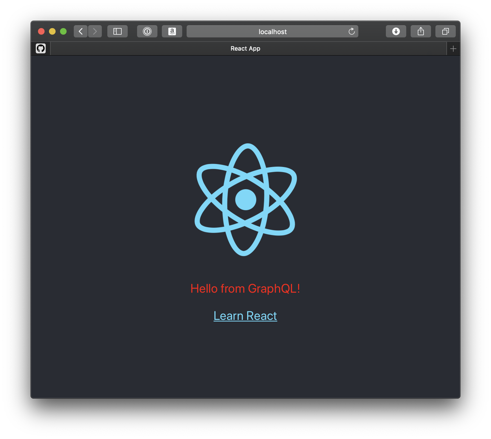

This project was bootstrapped with [Create React App](https://github.com/facebook/create-react-app) and replicates a lot of the Artsy omakase using Create React App 2.1.

- [adding TypeScript + Styled components](https://github.com/orta/omakase-create-react-app-example/commit/f4f605812e767bd144030737d0114e21fb422f8b)
- [adding Relay](https://github.com/orta/omakase-create-react-app-example/commit/be92641a00be382d333d97df3da96aef8dc08e2b)

We're interested in exploring having the [Artsy Omakase JS](https://speakerdeck.com/artsyopensource/the-artsy-omakase-artsy-x-react-native-2018)   stack to be a project that acts a lot like react-scripts does, and maybe one of the ways that it can exist is as a sibling _to_ react-scripts.

- Server: https://omakase-test-tyyewizbzn.now.sh
- API: https://qxxl39373p.lp.gql.zone/

